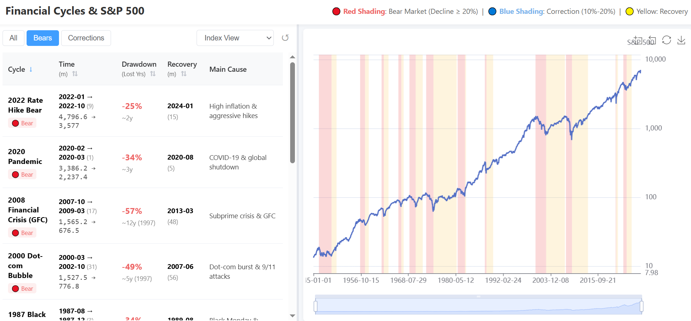

# Financial Cycles & S&P 500 Visualization

An interactive visualization tool to explore historical S&P 500 financial cycles, including bear markets (decline ≥ 20%), corrections (10%-20%), and recovery periods.

## Features

- **Interactive Charting**: Explore historical price action with integrated ECharts.
- **Drawdown Analysis**: View specific statistics for every major market drawdown since WWII.
- **Multiple Perspectives**:
  - **Index View**: Traditional log-scale price chart.
  - **Cycle View**: Percentage returns relative to previous peaks.
  - **Drawdown Comparison**: Overlay multiple market crashes to compare recovery speeds.
- **Data Filtering**: Easily toggle between bear markets and minor corrections.

## Preview


*(Note: Replace this with your own screenshot after deployment)*

## Live Demo

[View the Interactive Page](https://your-username.github.io/financial-cycles-sp500/)

## Local Setup

Simply clone the repository and open `index.html` in any modern web browser. No local server or installation is required.

```bash
git clone https://github.com/your-username/financial-cycles-sp500.git
cd financial-cycles-sp500
open index.html
```

## Data Source

The data is derived from S&P 500 weekly/monthly historical records. The repository includes `sp500_monthly.csv` for maintenance and data integrity.

## License

MIT License
